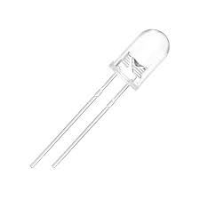
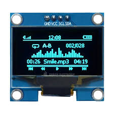
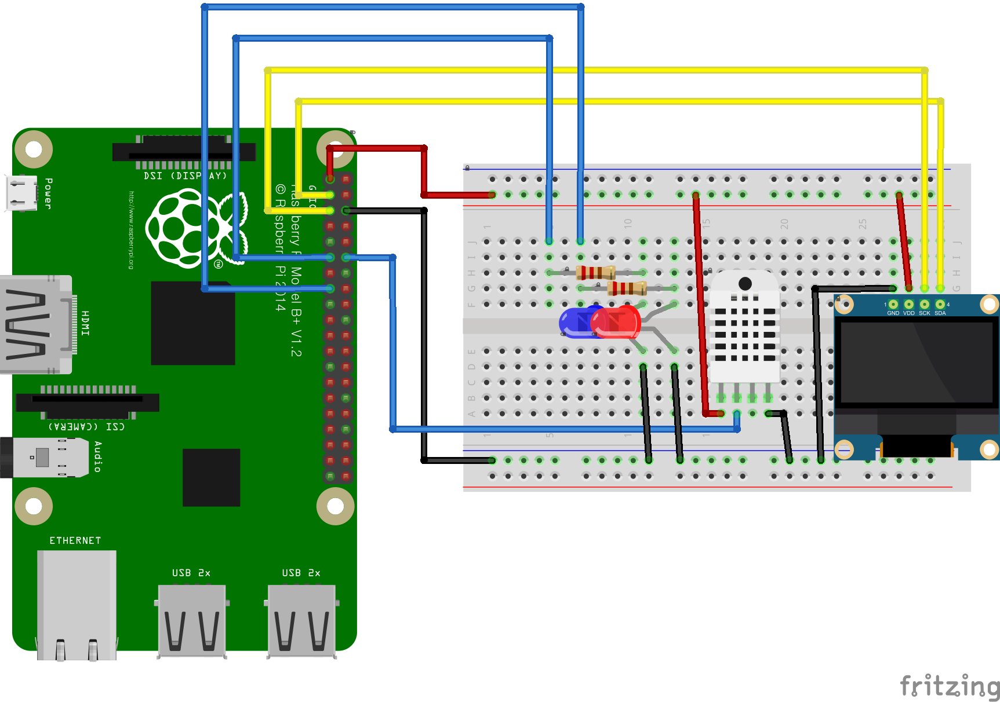
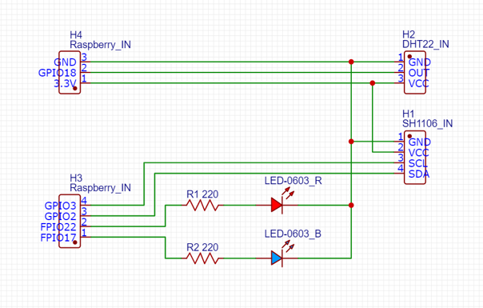
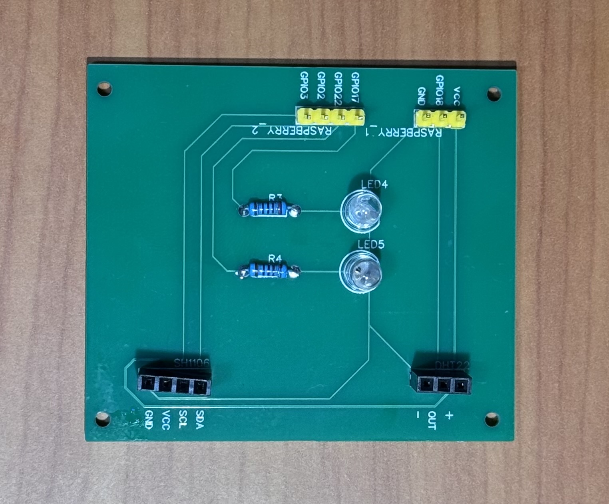
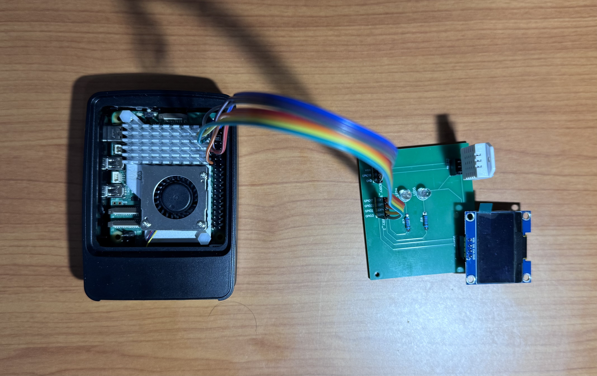

# Temp-Humi-Sensor
## 실행파일 생성
```bash
gcc dht22.c fonts.c TempHumiControl.c oled96.c -o TempHumiControl.out -lwiringPi
```
- 파일 가장 상단에 위치하도록 생성
```bash
cd server
source venv/bin/activate
uvicorn server:app --host 0.0.0.0 --port 8000
```
- server로 파일 이동
- venv 가상환경 실행
- uvicorn 서버 실행 0.0.0.0 에 8000번 포트(로컬 실행)
## 개요
온습도를 체크할 수 있는 센서 프로그램<br>

[📌온습도 체크 앱 링크📌](https://github.com/SonSeYoung02/Temp-Humi-Sensor-App) 

## 부품
### RaspberryPi 5


### DHT22 센서


### 발광다이오드


### sh1106(OLED)

## 설계도면
### 브레드보드(프로토타입)

### 회로도

### PCB 설계

### PCB 설계 후 제작


## 최종 모습
